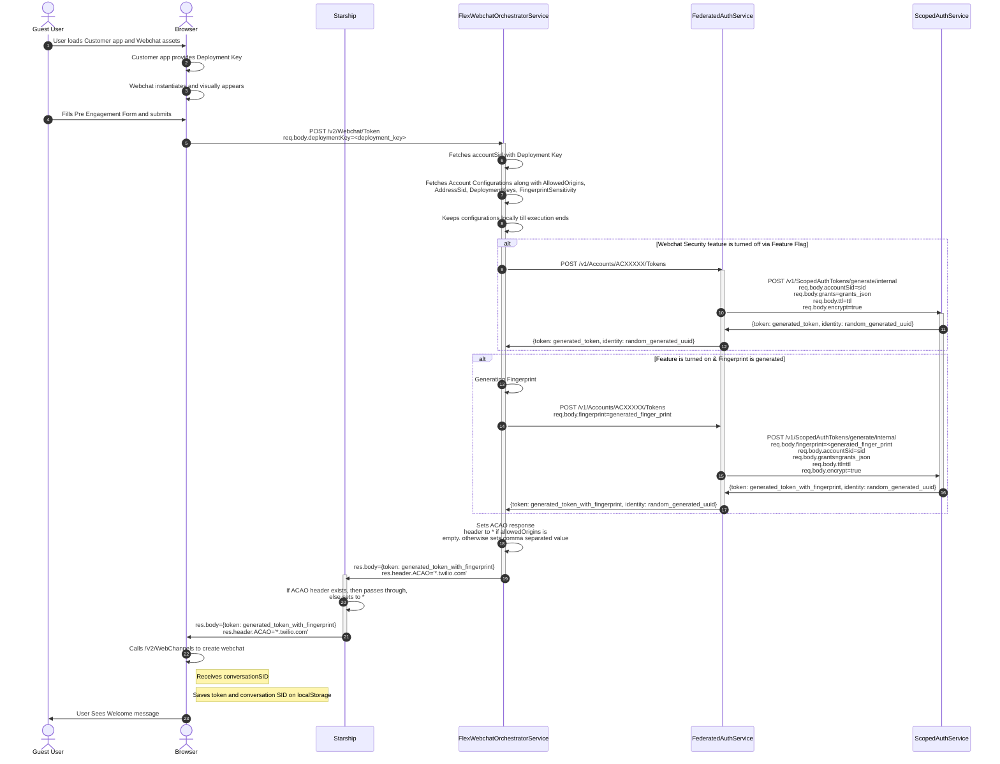

```mermaid
%% Webchat Create Token
sequenceDiagram
autonumber

actor C as Guest User
actor B as Browser
participant S as Starship
participant FWO as FlexWebchatOrchestratorService
participant FAS as FederatedAuthService
participant SAS as ScopedAuthService

C ->> B: User loads Customer app and Webchat assets
B ->> B: Customer app provides Deployment Key
B ->> B: Webchat instantiates and visually appears
C ->> B: Fills Pre Engagement Form and submits
B ->> FWO : POST /v2/Webchat/Token <br/>req.body.deploymentKey=<deployment_key>
activate FWO

FWO ->> FWO : Fetches accountSid with Deployment Key
FWO ->> FWO : Fetches Account Configurations along with AllowedOrigins,<br/>AddressSid, DeploymentKeys, FingerprintSensitivity
FWO ->> FWO : Keeps configurations locally till execution ends

alt Webchat Security feature is turned off via Feature Flag
	FWO ->> FAS : POST /v1/Accounts/ACXXXXX/Tokens
    activate FAS
	FAS ->> SAS : POST /v1/ScopedAuthTokens/generate/internal <br/>req.body.accountSid=sid <br/>req.body.grants=grants_json <br/>req.body.ttl=ttl<br/>req.body.encrypt=true
	activate SAS
    SAS ->> FAS : {token: generated_token, identity: random_generated_uuid}
    FAS ->> FWO : {token: generated_token, identity: random_generated_uuid}
end

alt Feature is turned on & Fingerprint is generated
    FWO ->> FWO: Generating Fingerprint
	FWO ->> FAS : POST /v1/Accounts/ACXXXXX/Tokens <br/>req.body.fingerprint=generated_finger_print <br/> 
    FAS ->> SAS : POST /v1/ScopedAuthTokens/generate/internal <br/>req.body.fingerprint=<generated_finger_print <br/>req.body.accountSid=sid <br/>req.body.grants=grants_json <br/>req.body.ttl=ttl<br/>req.body.encrypt=true
    SAS ->> FAS : {token: generated_token_with_fingerprint, identity: random_generated_uuid}
	deactivate SAS	
    FAS ->> FWO : {token: generated_token_with_fingerprint, identity: random_generated_uuid}
    deactivate FAS
end


FWO ->> FWO : Sets ACAO response <br/>header to * if allowedOrigins is <br/>empty. otherwise sets comma separated value
FWO ->> S : res.body={token: generated_token_with_fingerprint}<br/>res.header.ACAO='*.twilio.com'
activate S
deactivate FWO
S ->> S : If ACAO header exists, then passes through, <br/>else sets to *
S ->> B : res.body={token: generated_token_with_fingerprint}<br/>res.header.ACAO='*.twilio.com'
deactivate S

B ->> B: Calls /V2/WebChannels to create webchat
Note right of B: Receives conversationSID
Note right of B: Saves token and conversation SID on localStorage
B ->> C: User Sees Welcome message

```
