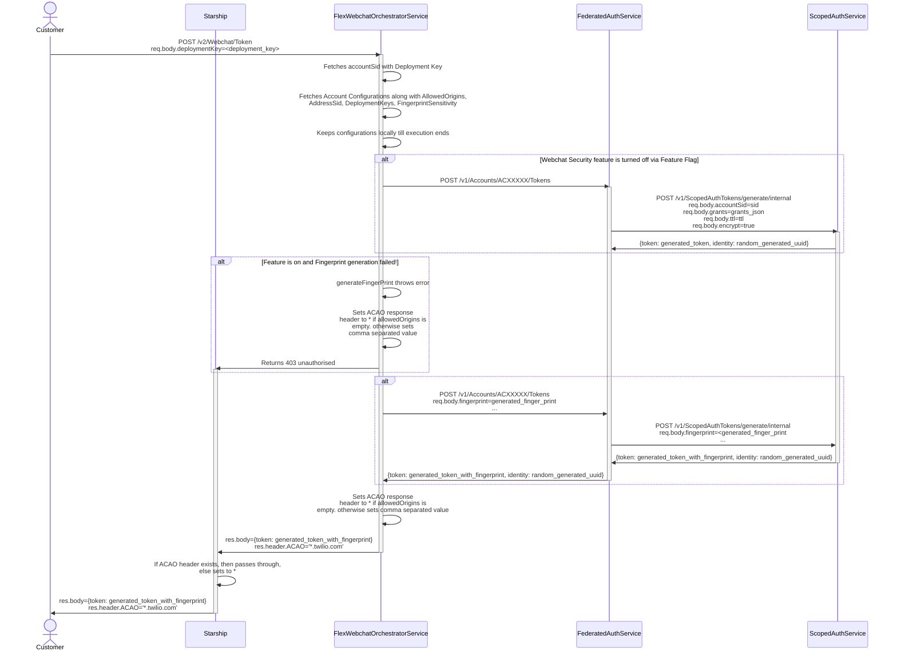

```mermaid
%% Webchat Create Token
sequenceDiagram

actor C as Customer
participant S as Starship
participant FWO as FlexWebchatOrchestratorService
participant FAS as FederatedAuthService
participant SAS as ScopedAuthService

C ->> FWO : POST /v2/Webchat/Token <br/>req.body.deploymentKey=<deployment_key>
activate FWO
FWO ->> FWO : Fetches accountSid with Deployment Key
FWO ->> FWO : Fetches Account Configurations along with AllowedOrigins,<br/>AddressSid, DeploymentKeys, FingerprintSensitivity
FWO ->> FWO : Keeps configurations locally till execution ends

alt Webchat Security feature is turned off via Feature Flag
	FWO ->> FAS : POST /v1/Accounts/ACXXXXX/Tokens
	activate FAS
	FAS ->> SAS : POST /v1/ScopedAuthTokens/generate/internal <br/>req.body.accountSid=sid <br/>req.body.grants=grants_json <br/>req.body.ttl=ttl<br/>req.body.encrypt=true
	activate SAS
	SAS ->> FAS : {token: generated_token, identity: random_generated_uuid}
end

alt Feature is on and Fingerprint generation failed!
	FWO ->> FWO: generateFingerPrint throws error
	FWO ->> FWO : Sets ACAO response <br/>header to * if allowedOrigins is <br/>empty. otherwise sets <br/>comma separated value
	FWO ->> S : Returns 403 unauthorised
	activate S
end

alt #LightBlue Feature is turned on & Fingerprint is generated
	FWO ->> FAS : POST /v1/Accounts/ACXXXXX/Tokens <br/>req.body.fingerprint=generated_finger_print <br/>... 
	FAS ->> SAS : POST /v1/ScopedAuthTokens/generate/internal <br/>req.body.fingerprint=<generated_finger_print <br/>...
	SAS ->> FAS : {token: generated_token_with_fingerprint, identity: random_generated_uuid}
	deactivate SAS
	FAS ->> FWO : {token: generated_token_with_fingerprint, identity: random_generated_uuid}
	deactivate FAS
end

FWO ->> FWO : Sets ACAO response <br/>header to * if allowedOrigins is <br/>empty. otherwise sets comma separated value
FWO ->> S : res.body={token: generated_token_with_fingerprint}<br/>res.header.ACAO='*.twilio.com'
deactivate FWO
S ->> S : If ACAO header exists, then passes through, <br/>else sets to *
S ->> C : res.body={token: generated_token_with_fingerprint}<br/>res.header.ACAO='*.twilio.com'
deactivate S

```