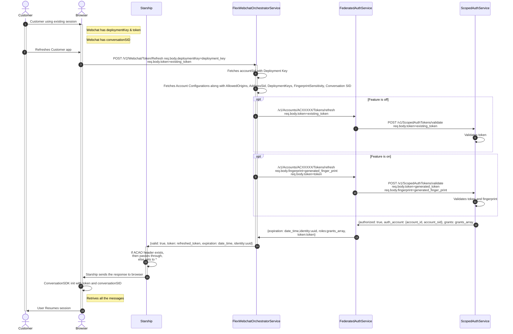

```mermaid
%% Webchat Refresh Token

sequenceDiagram
autonumber

actor C as Customer
actor B as Browser
participant S as Starship
participant FWO as FlexWebchatOrchestratorService
participant FAS as FederatedAuthService
participant SAS as ScopedAuthService

C ->> B: Customer using existing session
activate C
activate B

Note right of B: Webchat has deploymentKey & token
Note right of B: Webchat has conversationSID

C ->> B: Refreshes Customer app

B ->> FWO : POST /V2/Webchat/Token/Refresh req.body.deploymentKey=deployment_key <br/>req.body.token=existing_token

activate FWO
FWO ->> FWO : Fetches accountSid with Deployment Key
FWO ->> FWO : Fetches Account Configurations along with AllowedOrigins, AddressSid, DeploymentKeys, FingerprintSensitivity, Conversation SID

opt Feature is off
    FWO ->> FAS : /v1/Accounts/ACXXXXX/Tokens/refresh <br/>req.body.token=existing_token
    FAS ->> SAS : POST /v1/ScopedAuthTokens/validate <br/>req.body.token=existing_token
    SAS ->> SAS: Validates token
end

opt Feature is on
    FWO ->> FAS : /v1/Accounts/ACXXXXX/Tokens/refresh <br/>req.body.fingerprint=generated_finger_print <br/>req.body.token=token
    activate FAS
    FAS ->> SAS : POST /v1/ScopedAuthTokens/validate <br/>req.body.token=generated_token <br/>req.body.fingerprint=generated_finger_print
    SAS ->> SAS: Validates token and fingerprint
    activate SAS
end

SAS ->> FAS : {authorized: true, auth_account: {account_id, account_sid}, grants: grants_array
FAS ->> FWO : {expiration: date_time,identity:uuid, roles:grants_array,<br/>token:token}

FWO ->> S:  {valid: true, token: refreshed_token, expiration: date_time, identity:uuid}
deactivate FWO

activate S
S ->> S : If ACAO header exists, <br/>then passes through,  <br/>else sets to *
S ->> B : Starship sends the response to browser
deactivate S


B ->> B: ConversationSDK init with token and conversationSID
Note right of B: Retrives all the messages
B ->> C: User Resumes session
deactivate B
deactivate C

```
