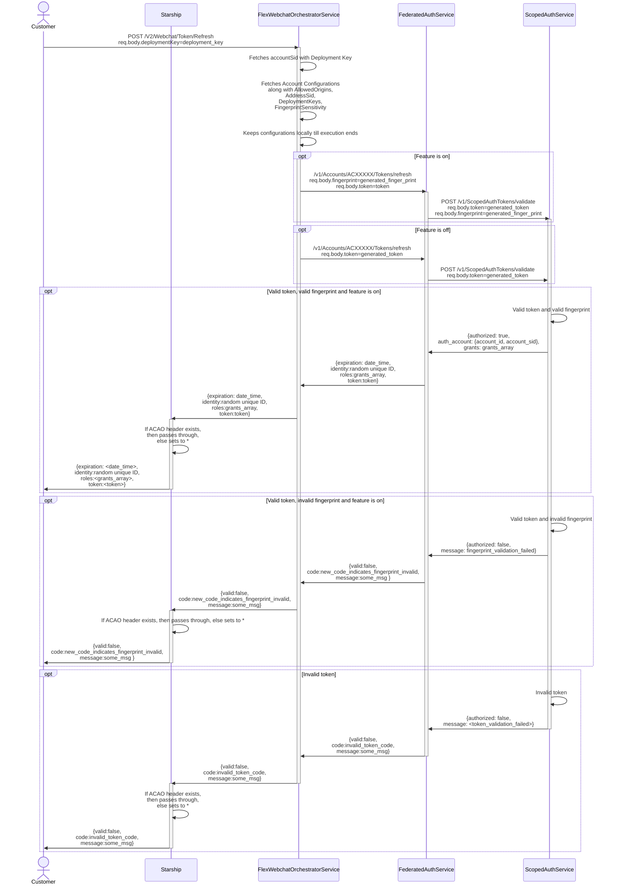

```mermaid
%% Webchat Refresh Token
sequenceDiagram

actor C as Customer
participant S as Starship
participant FWO as FlexWebchatOrchestratorService
participant FAS as FederatedAuthService
participant SAS as ScopedAuthService

C ->> FWO : POST /V2/Webchat/Token/Refresh <br/>req.body.deploymentKey=deployment_key
activate FWO
FWO ->> FWO : Fetches accountSid with Deployment Key
FWO ->> FWO : Fetches Account Configurations <br/>along with AllowedOrigins, <br/>AddressSid, <br/>DeploymentKeys, <br/>FingerprintSensitivity
FWO ->> FWO : Keeps configurations locally till execution ends

opt Feature is on
    FWO ->> FAS : /v1/Accounts/ACXXXXX/Tokens/refresh <br/>req.body.fingerprint=generated_finger_print <br/>req.body.token=token
    activate FAS
    FAS ->> SAS : POST /v1/ScopedAuthTokens/validate <br/>req.body.token=generated_token <br/>req.body.fingerprint=generated_finger_print
    activate SAS
end

opt Feature is off
    FWO ->> FAS : /v1/Accounts/ACXXXXX/Tokens/refresh <br/>req.body.token=generated_token
    FAS ->> SAS : POST /v1/ScopedAuthTokens/validate <br/>req.body.token=generated_token
end

opt Valid token, valid fingerprint and feature is on
    SAS ->> SAS: Valid token and valid fingerprint
    SAS ->> FAS : {authorized: true, <br/>auth_account: {account_id, account_sid}, <br/>grants: grants_array
    FAS ->> FWO : {expiration: date_time,<br/>identity:random unique ID, <br/>roles:grants_array,<br/>token:token}
    FWO ->> S : {expiration: date_time,<br/>identity:random unique ID, <br/>roles:grants_array,<br/>token:token}
    activate S
    S ->> S : If ACAO header exists, <br/>then passes through,  <br/>else sets to *
    S ->> C : {expiration: <date_time>,<br/>identity:random unique ID, <br/>roles:<grants_array>,<br/>token:<token>}
    deactivate S
end

opt Valid token, invalid fingerprint and feature is on
    SAS ->> SAS: Valid token and invalid fingerprint
    SAS ->> FAS : {authorized: false, <br/>message: fingerprint_validation_failed}
    FAS ->> FWO : {valid:false, <br/>code:new_code_indicates_fingerprint_invalid, <br/>message:some_msg }
    FWO ->> S : {valid:false, <br/>code:new_code_indicates_fingerprint_invalid, <br/>message:some_msg}
    activate S
    S ->> S : If ACAO header exists, then passes through, else sets to *
    S ->> C : {valid:false, <br/>code:new_code_indicates_fingerprint_invalid, <br/>message:some_msg }
    deactivate S
end

opt Invalid token
    SAS ->> SAS: Invalid token
    SAS ->> FAS : {authorized: false, <br/>message: <token_validation_failed>}
    deactivate SAS
    FAS ->> FWO : {valid:false, <br/>code:invalid_token_code, <br/>message:some_msg}
    deactivate FAS
    FWO ->> S : {valid:false, <br/>code:invalid_token_code, <br/>message:some_msg}
    deactivate FWO
    activate S
    S ->> S : If ACAO header exists, <br/>then passes through, <br/>else sets to *
    S ->> C : {valid:false, <br/>code:invalid_token_code, <br/>message:some_msg}
    deactivate S
end

```
