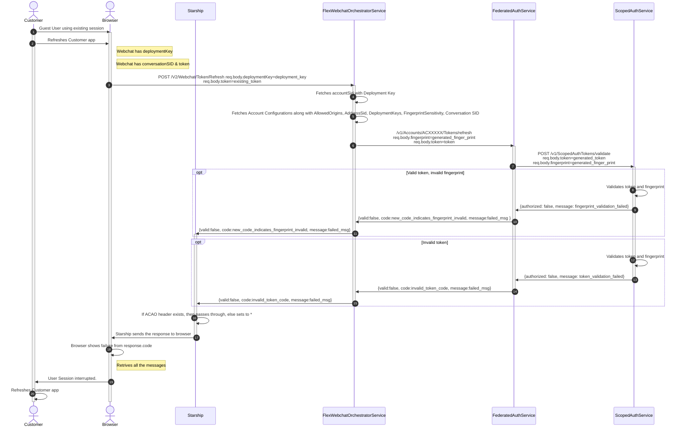

```mermaid
%% Webchat Refresh Token Failed

sequenceDiagram
autonumber

actor C as Customer
actor B as Browser
participant S as Starship
participant FWO as FlexWebchatOrchestratorService
participant FAS as FederatedAuthService
participant SAS as ScopedAuthService

C ->> B: Guest User using existing session
activate C
activate B
C ->> B: Refreshes Customer app
Note right of B: Webchat has deploymentKey 
Note right of B: Webchat has conversationSID & token


B ->> FWO : POST /V2/Webchat/Token/Refresh req.body.deploymentKey=deployment_key <br/>req.body.token=existing_token
activate FWO
FWO ->> FWO : Fetches accountSid with Deployment Key
FWO ->> FWO : Fetches Account Configurations along with AllowedOrigins, AddressSid, DeploymentKeys, FingerprintSensitivity, Conversation SID

FWO ->> FAS : /v1/Accounts/ACXXXXX/Tokens/refresh <br/>req.body.fingerprint=generated_finger_print <br/>req.body.token=token
activate FAS
FAS ->> SAS : POST /v1/ScopedAuthTokens/validate <br/>req.body.token=generated_token <br/>req.body.fingerprint=generated_finger_print
activate SAS

opt Valid token, invalid fingerprint
    SAS ->> SAS: Validates token and fingerprint
    SAS ->> FAS : {authorized: false, message: fingerprint_validation_failed}
    FAS ->> FWO : {valid:false, code:new_code_indicates_fingerprint_invalid, message:failed_msg }
    FWO ->> S : {valid:false, code:new_code_indicates_fingerprint_invalid, message:failed_msg}
    activate S
end

opt Invalid token
    SAS ->> SAS: Validates token and fingerprint
    SAS ->> FAS : {authorized: false, message: token_validation_failed}
    deactivate SAS
    FAS ->> FWO : {valid:false, code:invalid_token_code, message:failed_msg}
    deactivate FAS
    FWO ->> S : {valid:false, code:invalid_token_code, message:failed_msg}
end
deactivate FWO


S ->> S : If ACAO header exists, then passes through, else sets to *
S ->> B : Starship sends the response to browser
deactivate S


B ->> B: Browser shows failure from response.code
Note right of B: Retrives all the messages
B ->> C: User Session interrupted. 
C ->> C: Refreshes Customer app
deactivate B
deactivate C

```
