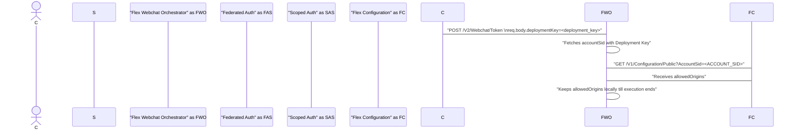

```mermaid
%% Example of sequence diagram
sequenceDiagram
    actor Customer as C
    participant Starship as S
    participant "Flex Webchat Orchestrator" as FWO
    participant "Federated Auth" as FAS
    participant "Scoped Auth" as SAS
    participant "Flex Configuration" as FC


    C -> FWO : "POST /V2/Webchat/Token \nreq.body.deploymentKey=<deployment_key>"

    FWO -> FWO : "Fetches accountSid with Deployment Key"
    FWO -> FC : "GET /V1/Configuration/Public?AccountSid=<ACCOUNT_SID>"

    FC -> FWO : "Receives allowedOrigins"

    FWO -> FWO : "Keeps allowedOrigins locally till execution ends"

```