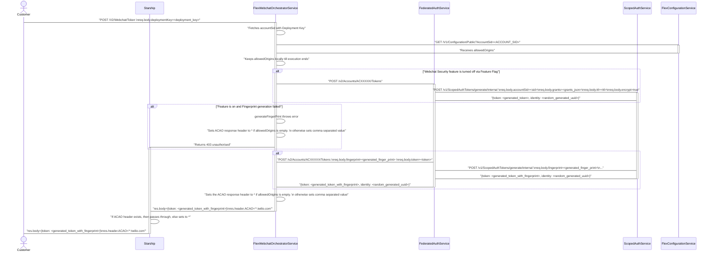

```mermaid
%% Example of sequence diagram
sequenceDiagram
    actor C as Customer
    participant S as Starship
    participant FWO as FlexWebchatOrchestratorService
    participant FAS as FederatedAuthService
    participant SAS as ScopedAuthService
    participant FC as FlexConfigurationService

    C -> FWO : "POST /V2/Webchat/Token \nreq.body.deploymentKey=<deployment_key>"
    activate FWO
    FWO -> FWO : "Fetches accountSid with Deployment Key"
    FWO -> FC : "GET /V1/Configuration/Public?AccountSid=<ACCOUNT_SID>"
    activate FC
    FC -> FWO : "Receives allowedOrigins"
    deactivate FC
    FWO -> FWO : "Keeps allowedOrigins locally till execution ends"

    alt "Webchat Security feature is turned off via Feature Flag"
        FWO -> FAS : "POST /v2/Accounts/ACXXXXX/Tokens"
        activate FAS
        FAS -> SAS : "POST /v1/ScopedAuthTokens/generate/internal \nreq.body.accountSid=<sid>\nreq.body.grants=<grants_json>\nreq.body.ttl=<ttl>\nreq.body.encrypt=true"
        activate SAS
        SAS -> FAS : "{token: <generated_token>, identity: <random_generated_uuid>}"
    end

    alt "Feature is on and Fingerprint generation failed!"
        FWO -> FWO: generateFingerPrint throws error
        FWO -> FWO : "Sets ACAO response header to * if allowedOrigins is  empty. \n otherwise sets comma separated value"
        FWO -> S : "Returns 403 unauthorised"
        activate S
    end

    alt #LightBlue "Feature is turned on & Fingerprint is generated"
        FWO -> FAS : "POST /v2/Accounts/ACXXXXX/Tokens \nreq.body.fingerprint=<generated_finger_print> \nreq.body.token=<token>" 
        FAS -> SAS : "POST /v1/ScopedAuthTokens/generate/internal \nreq.body.fingerprint=<generated_finger_print>\n..."
        SAS -> FAS : "{token: <generated_token_with_fingerprint>, identity: <random_generated_uuid>}"
        deactivate SAS
        FAS -> FWO : "{token: <generated_token_with_fingerprint>, identity: <random_generated_uuid>}"
        deactivate FAS
    end

    FWO -> FWO : "Sets the ACAO response header to * if allowedOrigins is  empty. \n otherwise sets comma separated value"
    FWO -> S : "res.body={token: <generated_token_with_fingerprint>}\nres.header.ACAO='*.twilio.com'"
    deactivate FWO
    S -> S : "If ACAO header exists, then passes through, else sets to *"
    S -> C : "res.body={token: <generated_token_with_fingerprint>}\nres.header.ACAO='*.twilio.com'"
        deactivate S


```